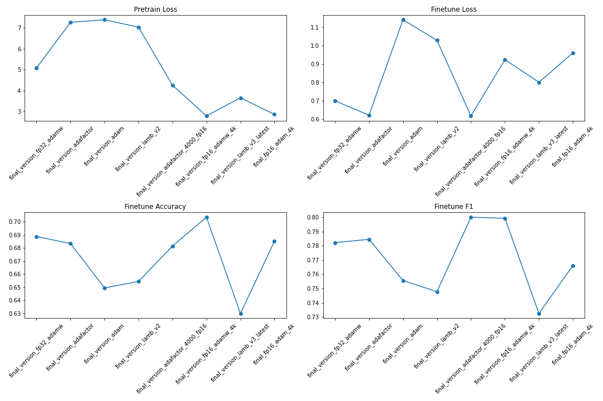

# Optimized BERT - Pretraining and Fine-tuning

This repository is a part of the HPML Final Project by Inder Preet Singh Walia and Jash Rathod. It is an optimized BERT implementation, where we used the Wikipedia dataset from Hugging Face and divided it into 2560 Hadoop files. The repository provides tools for both pre-training BERT from scratch and fine-tuning the pre-trained models.

# Guidelines

After closing the repo please download this folder tmp from google drive:https://drive.google.com/drive/folders/1_cwnC4Bm_4aHPMcyL8xt8wHDKuJNpjJY?usp=sharing and add this in your repository before running the project. This folder contains weights for all the different models.

All the different saved model files can be found here:https://drive.google.com/drive/u/2/folders/1_gzbCcoHDjUeFl98cPLZ3yY1lyhojYYn

## Dataset Preparation
To download and prepare the dataset, run `prepare_dataset.py`. This will download the Wikipedia dataset and shard it into Hadoop files.

## Pretraining
For pre-training, run the bash `<optimizer-name>.sh` file. It uses different optimizers like Adam, Lamb, AdamW, and Adafactor. You can adjust the number of epochs using the parameter in the bash file.

The script `run_pretraining.py` is used for the pretraining process, which accepts a number of parameters:

- `model_type` and `tokenizer_name`: These specify the model type and tokenizer (here, 'bert-large-uncased').

- `hidden_size`, `num_hidden_layers`, `num_attention_heads`, `intermediate_size`: These are hyperparameters for the architecture of the BERT model.

- `lr`, `train_batch_size`, `train_micro_batch_size_per_gpu`, `lr_schedule`, `curve`, `warmup_proportion`, `gradient_clipping`: These are various parameters to control the learning process.

- `optimizer_type`, `weight_decay`, `adam_beta1`, `adam_beta2`, `adam_eps`: These parameters control the optimizer behavior.

- `total_training_time`, `early_exit_time_marker`, `dataset_path`, `output_dir`, `print_steps`, `num_epochs_between_checkpoints`: These parameters help in managing the training process, data locations and checkpointing.

- `job_name`, `project_name`, `validation_epochs`, `validation_epochs_begin`, `validation_epochs_end`, `validation_begin_proportion`, `validation_end_proportion`, `validation_micro_batch`: These parameters are for managing the validation process and logging.

- `deepspeed`, `data_loader_type`, `do_validation`, `use_early_stopping`, `early_stop_time`, `early_stop_eval_loss`, `seed`: These parameters are for using deepspeed, data loading, validation, early stopping, and setting the random seed.

## Fine-tuning
We have fine-tuned our model on the MRPC dataset. You can find the fine-tuning results in the `tmp/finetune` folder. Run the bash `finetune.sh` for fine-tuning the dataset. The script supports various tasks like MRPC, CoLA, MNLI, QNLI, and more.

The `run_glue.py` script is used for the fine-tuning process, which accepts a number of parameters:

- `model_name_or_path`: The path to the model or model type to use for fine-tuning.

- `task_name`: The GLUE task to be used for fine-tuning.

- `max_seq_length`: The maximum total input sequence length after tokenization.

- `output_dir`: The directory where the model predictions and checkpoints will be written.

- `do_train`, `do_eval`: Flags to determine whether to perform training and evaluation.

- `evaluation_strategy`: The evaluation strategy to use.

- `per_device_train_batch_size`, `per_device_eval_batch_size`, `gradient_accumulation_steps`: These parameters control the batch size for training and evaluation.

- `learning_rate`, `weight_decay`, `max_grad_norm`: These parameters control the learning behavior.

- `eval_steps`: The number of steps between evaluations.

- `num_train_epochs`: The total number of training epochs to perform.

- `lr_scheduler_type`: The learning rate scheduler type to use.

## Results

| Model Name | Optimizer | Quantization | Number of Epochs | Pretrain loss | Finetune Loss | Finetune Accuracy | Finetune F1 |
|---|---|---|---|---|---|---|---|
| final_version_fp32_adamw | AdamW | fp32 | 1000 | 5.085 | 0.6992 | 0.6887 | 0.7822 |
| final_version_adafactor | Adafactor | fp16 | 1000 | 7.266 | 0.6211 | 0.6833 | 0.7845 |
| final_version_adam | Adam | fp16 | 1000 | 7.389 | 1.141 | 0.6495 | 0.7556 |
| final_version_lamb_v2 | LAMB | fp16 | 1000 | 7.033 | 1.029 | 0.6544 | 0.7478 |
| final_version_adafactor_4000_fp16 | Adafactor | fp16 | 4000 | 4.257 | 0.6167 | 0.6814 | 0.8 |
| final_version_fp16_adamw_4k | AdamW | fp16 | 4000 | 2.781 | 0.9238 | 0.7034 | 0.7993 |
| "final_version_lamb_v3_latest" | LAMB | fp16 | 4000 | 3.651 | 0.8003 | 0.63 | 0.7325 |
| final_fp16_adam_4k | Adam | fp16 | 4000 | 2.858 | 0.96 | 0.685 | 0.7661 |

![Model Performance Plots]

In our experiments, the following conclusions were made:

- **1000 epochs**: AdamW optimizer and fp32 quantization achieved the lowest fine-tune loss and the highest fine-tune accuracy and F1 score.
- **4000 epochs**: AdamW optimizer and fp16 quantization achieved the highest fine-tune accuracy and F1 score, even though it did not have the lowest fine-tune loss (training for more steps needed).
- Longer training improves results.
- The LAMB optimizer did not yield the highest performance in these experiments, contrary to what might be expected given its design for larger models and larger batch sizes.

### Weights & Biases (wandb):

- https://wandb.ai/dl1998/final_fp16_adam_4k  
- https://wandb.ai/dl1998/final_version_adafactor  
- https://wandb.ai/dl1998/final_version_adam  
- https://wandb.ai/dl1998/final_version_lamb_v2  
- https://wandb.ai/dl1998/final_version_adafactor_4000_fp16  
- https://wandb.ai/dl1998/final_version_fp16_adamw_4k  
- https://wandb.ai/dl1998/final_version_lamb_v3_latest  
- https://wandb.ai/dl1998/final_fp16_adam_4k  

## Additional Experiments

- Knowledge Distillation: Check notebook [`knowledge_distillation.ipynb`](knowledge_distillation.ipynb). We used vanilla Knowledge Distillation for pretrained bert models from HuggingFace. As we observed only a marginal improvement while fine-tuning, we decided to pursue pre-training BERT models.

## References
We have referred to the following repository for our project: [IntelLabs' academic-budget-bert](https://github.com/IntelLabs/academic-budget-bert)

Additionally,

- Devlin, Jacob, et al. "Bert: Pre-training of deep bidirectional transformers for language understanding." arXiv preprint arXiv:1810.04805 (2018).
- Izsak, Peter, Moshe Berchansky, and Omer Levy. "How to train BERT with an academic budget." arXiv preprint arXiv:2104.07705 (2021).

## Contributing
Please feel free to open an issue or pull request if you find a bug or have suggestions for improvements.

## License
This project is licensed under the terms of the MIT license.
